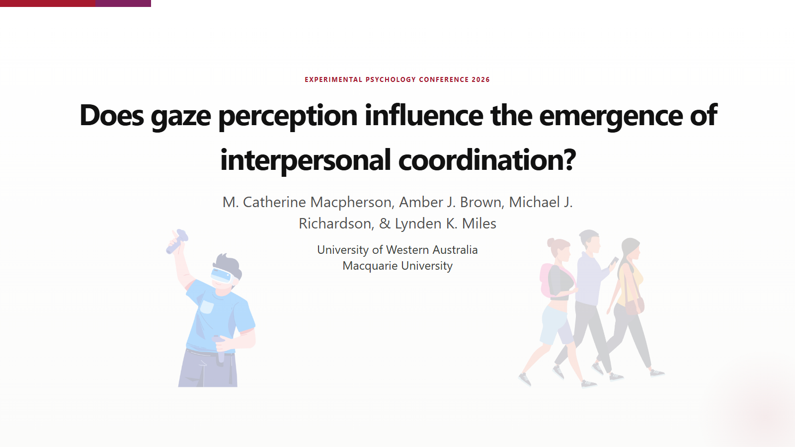
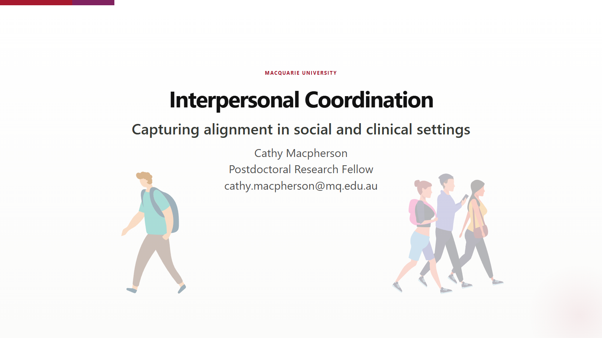

# Slides

Hello! This repository contains various presentations from colloquia and conferences that I've spoken at over the past year.

Each talk is available as an HTML presentation that can be opened directly in a browser.

## Currently Available Talks

<table>
  <tr>
    <td width="50%" valign="top">
      
      <h3>Experimental Psychology Conference 2026</h3>
      
<strong>Does gaze perception influence the emergence of interpersonal coordination?</strong>

      
Conference presentation on participant gaze, partner gaze, and interpersonal coordination in virtual reality.

      
<a href="https://cathymacpherson.github.io/slides/epc_2026/"><strong>Open slides</strong></a>

    </td>
    <td width="50%" valign="top">
      
      <h3>Macquarie University SoPS Colloquium 2026</h3>
      
<strong>Interpersonal coordination: capturing alignment in social and clinical settings</strong>

      
Colloquium presentation on capturing alignment across social and clinical contexts.

      
<a href="https://cathymacpherson.github.io/slides/mq_colloquium_2026/"><strong>Open slides</strong></a>

    </td>
  </tr>
</table>

## Viewing The Slides

Use the links above to open each talk in your browser. Once a talk is open:

- Use the arrow keys or spacebar to move through the slides.
- Press `F` for fullscreen.
- Press `O` for overview mode.
- Press `N` to show speaker notes, where available.

## Further Information

If you are interested in any of the work presented within these slide decks, many of the corresponding papers can be found on my Macquarie University profile: 

https://researchers.mq.edu.au/en/persons/cathy-macpherson/
